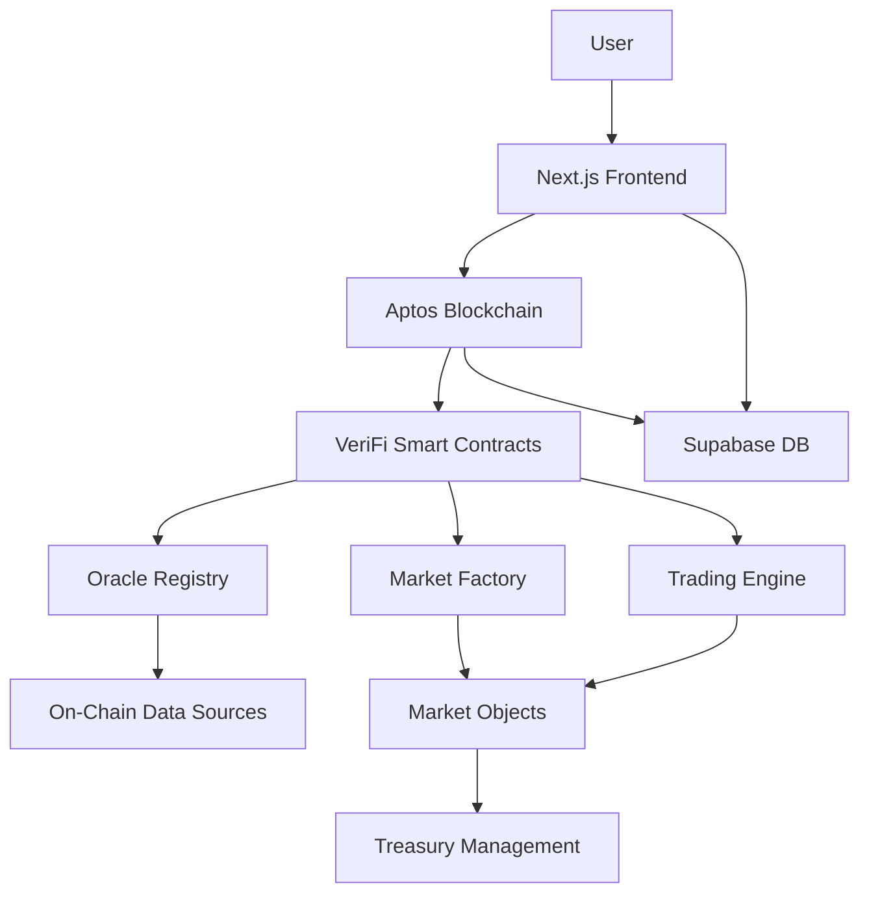

# VeriFi Protocol: The On-Chain Oracle

> **Transform on-chain data into tradable markets. No external oracles. Pure blockchain truth.**

[](https://aptoslabs.com)
[](https://verifi-protocol.vercel.app)

VeriFi is a decentralized derivatives protocol that empowers anyone to create prediction markets on verifiable, on-chain events—directly on the Aptos blockchain, without external oracles.

---

## The Vision

Imagine a financial ecosystem where **any on-chain truth** can become a liquid, tradable market. Where creating financial instruments isn't restricted to experts, but open to the entire community. That's VeriFi Protocol.

## The Problem

Current prediction markets face two critical barriers:

1. **Insecure Oracle Reliance**: External oracles create single points of failure
2. **Complex Market Creation**: Technical barriers exclude non-developers and silence community insights

These limitations prevent Aptos from realizing its vision of trustless, frictionless value movement.

## Our Solution

VeriFi solves both problems with:

### Oracle-less Architecture
Markets resolve **100% programmatically** by directly querying other Aptos contracts. Check a protocol's TVL, a DAO proposal's outcome, or any on-chain metric—without external dependencies.

### AI-Powered Market Creation
Our intelligent dashboard makes market creation trivial:
1. **Natural Language Input**: Describe your market in plain English
2. **AI Validation**: Claude analyzes feasibility and suggests improvements
3. **Smart Extraction**: AI fills parameters (protocol, metric, conditions, dates)
4. **One-Click Deploy**: Template engine handles all contract complexity

Example: "Will Circle USDC total supply exceed 5M by March 15th?" → Fully configured market in seconds.

### The "Market Creator" Economy
Every user can become a market creator, monetizing their ecosystem insights and knowledge.

---

## Technical Architecture



### Smart Contracts (Move)
- **Market Factory**: Creates isolated market objects with resource accounts
- **Oracle Registry**: Whitelists and manages on-chain data sources
- **Trading Engine**: Primary issuance (1 APT = 1 YES + 1 NO)
- **Resolution Module**: Programmatic settlement via on-chain queries

### Frontend Stack
- **Next.js 15 + React 19**: Modern, performant UI
- **Aptos Wallet Adapter**: Universal wallet support
- **Supabase**: Real-time event indexing
- **shadcn/ui**: Beautiful, accessible components

### Key Innovations
1. **Resource Account Architecture**: Each market has isolated treasury
2. **Template Engine**: Maps UI selections to contract calls
3. **Hybrid Trading**: Primary issuance + AMM pools (Tapp.Exchange integration ready)
4. **Real-time Indexing**: Direct blockchain event monitoring

---

## What We've Built

### Core Features
- Oracle-less market creation and resolution
- AI-powered market creation with natural language input
- Buy/sell YES/NO outcome tokens
- Portfolio tracking with P&L
- AMM pools with liquidity provision (Tapp integration)
- Swap YES/NO tokens with real-time price impact
- Liquidity positions dashboard with PnL tracking
- Transaction explorer links for on-chain verification
- Real-time notifications with clickable transaction links
- Admin control panel
- Comprehensive test suite (90%+ coverage)

### Professional UI/UX Enhancements
- **Skeleton-first loading pattern**: Progressive loading with skeleton → loader → content (400ms transitions)
- **Bouncy animations**: Professional cubic-bezier easing [0.34, 1.56, 0.64, 1] throughout the application
- **Staggered entrance animations**: Progressive reveals with calculated delays for smooth user experience
- **Hover interactions**: Scale and translate effects on interactive elements
- **Real-time market pulse monitor**: Live market activity tracking with momentum indicators
- **Featured markets grid**: AI-powered ranking engine with activity, volatility, and urgency scores
- **Analytics dashboard**: Protocol overview, top traders, volume charts, and market intelligence
- **Responsive design**: Mobile-first approach with Tailwind CSS and shadcn/ui components

### Supported Oracles
- **Aptos Balance Oracle**: Track any account's APT holdings
- **USDC Total Supply**: Monitor USDC circulation
- **Extensible**: Add custom oracles via registry

###  Tapp.Exchange AMM Integration

**VeriFi is the first prediction market to implement a custom Tapp hook + integrated AMM UI**

#### Modular DeFi Integration

VeriFi integrates with **[Tapp.Exchange](https://tapp.exchange)**, a modular AMM protocol on Aptos that enables custom trading logic through a hook system. This integration demonstrates how VeriFi composes with the broader Aptos DeFi ecosystem.

**Integration Architecture:**
- **Core AMM**: Uses Tapp's mini-AMM implementation from [`tapp-exchange/hook-documentation`](https://github.com/tapp-exchange/hook-documentation)
- **Custom Hook**: `contract/sources/tapp_prediction_hook.move` - Our prediction market-specific logic
- **Tapp Dependencies**: `contract/test-deps/` - Deployed Tapp contracts for local testing
- **Open Source Contribution**: [Pull Request #3](https://github.com/tapp-exchange/hook-documentation/pull/3) submitted to Tapp's official repo

#### Smart Contract Hook (`tapp_prediction_hook.move`)
- **Full Hook Interface**: Implements create_pool, add_liquidity, remove_liquidity, swap, collect_fee
- **Dynamic Fees**: 0.3% base fee, 0.5% during high volatility (< 1h to resolution)
- **Auto-disable Trading**: Pools stop trading when market resolves
- **NFT-based Positions**: Liquidity providers receive Tapp position NFTs
- **Market-Aware**: Directly queries VeriFi markets to validate tokens and disable trading on resolution

#### Integrated AMM UI (Production Ready)
- **Pool Creation**: One-click pool deployment from market page
- **Add Liquidity**: Deposit YES/NO tokens, receive LP tokens with position NFTs
- **Swap Interface**: Trade tokens with live price impact preview
- **Liquidity Dashboard**: View positions with real-time PnL calculations
- **Transaction Links**: Direct links to Aptos Explorer for verification
- **React Query Optimistic Updates**: Instant UI updates after transactions

**Current Status:**
- **UI/Frontend**: Fully functional on testnet with complete AMM flow
- **Hook Implementation**: Custom prediction market hook with dynamic fees
- **Open Source PR**: Submitted to [Tapp's hook documentation](https://github.com/tapp-exchange/hook-documentation/pull/3)
- **Hook Deployment**: Under review per [official process](https://github.com/tapp-exchange/hook-documentation#submission-process)

**Why This Matters:**
- **Composability**: YES/NO tokens tradable on any Tapp-compatible DEX
- **Liquidity**: LPs earn fees on both outcome sides
- **Best UX**: Seamless integration directly in market pages
- **Innovation**: First hook to bring prediction markets to Tapp ecosystem
- **Modular Design**: Demonstrates how prediction markets integrate with existing DeFi infrastructure

See [TAPP_INTEGRATION_COMPLETE.md](./TAPP_INTEGRATION_COMPLETE.md) for technical implementation details.

---

## Quick Start

### Prerequisites
- Node.js 18+
- pnpm
- Aptos CLI
- PostgreSQL (via Supabase)

### Installation

```bash
# Clone repository
git clone https://github.com/yourusername/verifi-protocol
cd verifi-protocol

# Install dependencies
pnpm install

# Configure environment
cp .env.example .env.local
# Add your Supabase and Aptos credentials

# Run database migrations
pnpm prisma migrate dev

# Start development server
pnpm dev
```

### Deploy Contracts

```bash
# Compile Move contracts
pnpm move:compile

# Publish to testnet
pnpm move:publish

# Generate TypeScript ABIs
pnpm move:get_abi
```

### Testing

```bash
# Run Move unit tests
pnpm move:test

# Run full E2E flow
pnpm test:full-flow
```

---

## Open Source Contributions

### 1. VeriFi SDK - Authentication & Core Utilities

During development, we identified the need for lightweight, modular authentication and core utilities for Aptos. We extracted and open-sourced these as standalone npm packages:

#### [@verifi-sdk/auth-core](https://www.npmjs.com/package/@verifi-sdk/auth-core) (v0.1.0)
**Universal authentication primitives** - Framework & blockchain agnostic

**Features:**
- JWE Session Encryption (AES-256-GCM) - More secure than JWT
- Pluggable storage adapters
- Zero blockchain dependencies
- Works with Aptos, Solana, EVM, etc.
- ~17kb package size

**Usage:**
```typescript
import { initJWE, encryptSession, decryptSession } from '@verifi-sdk/auth-core';

initJWE({ secret: process.env.JWT_SECRET });
const token = await encryptSession({ address, publicKey, loginTime: Date.now() });
```

#### [@verifi-sdk/auth-aptos](https://www.npmjs.com/package/@verifi-sdk/auth-aptos) (v0.1.0)
**Aptos-specific SIWA authentication** - Lightweight, no heavy SDK dependencies

**Features:**
- Sign In With Aptos (SIWA) - Full implementation
- Dual signature schemes: Ed25519 (wallets) + BLS12-381 (ZK-ready)
- Wallet adapter (minimal, no React coupling)
- ~44kb package size (vs 800kb+ with full Aptos SDK)
- Extracted only necessary cryptography from `@noble/curves`

**Usage:**
```typescript
import { generateNonce, verifyEd25519, encryptSession } from '@verifi-sdk/auth-aptos';

// Backend SIWA verification
const nonce = generateNonce();
const isValid = await verifyEd25519(signature, message, publicKey);
const token = await encryptSession({ address, publicKey, loginTime: Date.now() });
```

**Why We Built This:**
- **Lightweight**: No 800kb+ Aptos SDK dependency for simple auth
- **Modular**: Core utilities separated from chain-specific logic
- **Professional**: Follows industry patterns (stateless auth, storage adapters)
- **ZK-Ready**: BLS12-381 support for future ZK integrations

**Install:**
```bash
npm install @verifi-sdk/auth-aptos
# or
pnpm add @verifi-sdk/auth-aptos
```

---

### 2. Aptos Move Boilerplate

During development, we also encountered significant challenges with outdated Aptos development tooling. The official boilerplates were not updated for Next.js 15, React 19, or the latest Aptos SDK changes.

#### [aptos-move-boilerplate-nextjs15](https://github.com/edsphinx/aptos-move-boilerplate-nextjs15)

**Features:**
- **Next.js 15 + React 19** - Latest framework versions with proper TypeScript configuration
- **Aptos SDK v2** - Updated wallet adapter and client setup
- **Auto-generated ABIs** - Scripts to generate TypeScript types from deployed contracts
- **Organized Structure** - Best practices for aptos/, components/, and contract/ folders
- **Move Development** - Configured Move.toml with proper named addresses
- **Testing Scripts** - E2E test templates for common flows
- **Environment Setup** - Complete .env configuration guide

**Why We Built This:**
After spending weeks fixing compatibility issues, we wanted to save other developers from the same frustration. This boilerplate embodies the lessons learned from building a production Aptos application.

**We invite developers to use this boilerplate to build modern, full-stack Aptos applications without the setup headaches.**

```bash
# Quick start with the boilerplate
git clone https://github.com/edsphinx/aptos-move-boilerplate-nextjs15
cd aptos-move-boilerplate-nextjs15
pnpm install
pnpm dev
```

---

## Documentation

- [Architecture Overview](./ARCHITECTURE.md)
- [Smart Contract Guide](./contract/README.md)
- [Testing Guide](./docs/TESTING.md)
- [Deployment Guide](./docs/TAPP_DEPLOYMENT_GUIDE.md)

---

## Hackathon Deliverables

### Aptos Ctrl+MOVE Hackathon 2025

**Track**: DeFi & Payments

**Bounties Targeted**:
- **Best DeFi Protocol**: Novel oracle-less architecture for trustless markets
- **Best Use of Aptos Primitives**: Resource accounts, Object model, Fungible Assets
- **Best UX**: Guided market creation democratizes DeFi innovation

**Key Differentiators**:
1. **First oracle-less prediction market on Aptos** - Programmatic resolution eliminates trust assumptions
2. **First prediction market with Tapp AMM integration** - Full UI/UX for swap and liquidity provision with custom hook
3. **AI-powered market creation** - Natural language input with Claude validation and smart parameter extraction
4. **Production-ready architecture** - Comprehensive testing, proper error handling, event-driven indexing
5. **Best-in-class UX** - Professional animations, skeleton-first loading, real-time updates with transaction explorer links
6. **Advanced analytics** - Market pulse monitoring, AI-powered featured markets ranking, trader intelligence
7. **Composable by design** - YES/NO tokens are standard Fungible Assets, work with any DEX
8. **Open Source Contribution** - Created modern [Aptos boilerplate](https://github.com/edsphinx/aptos-move-boilerplate-nextjs15) for Next.js 15 + React 19
9. **Modular DeFi Integration** - [Contributed custom hook](https://github.com/tapp-exchange/hook-documentation/pull/3) to Tapp.Exchange ecosystem
10. **TypeScript strict mode** - Full type safety with comprehensive type definitions across the application

---

## Roadmap

### Phase 1: Foundation (Complete)
- Core protocol implementation
- Primary market trading
- Basic oracle registry
- AI-powered market creation
- Full Tapp AMM integration (UI)

### Phase 2: Enhanced Trading (In Progress)
- Tapp hook testnet deployment
- Advanced portfolio analytics
- Multi-oracle market conditions
- Cross-DEX liquidity aggregation

### Phase 3: Ecosystem Growth (Planned)
- Multi-language AI support (Spanish, Chinese)
- Cross-protocol oracle integrations (Thala, PancakeSwap, etc.)
- Governance token and DAO
- Mobile app with push notifications

---

## The Team

**EdSphinx** - Full-stack Web3 Developer
- Winner: Veritas Protocol (Infinita DeSci Hackathon)
- Winner: SocialDrop (Base MiniApp Hackathon)
- 5+ years blockchain development
- [GitHub](https://github.com/edsphinx) | [Twitter](https://twitter.com/edsphinx)

---

## License

MIT License - see [LICENSE](./LICENSE) for details

---

## Links

- **Live Demo**: [verifi-protocol.vercel.app](https://verifi-protocol.vercel.app)
- **Demo Video**: [Coming Soon]
- **Hackathon Submission**: [DoraHacks](https://dorahacks.io)
- **Documentation**: [GitHub Wiki](https://github.com/yourusername/verifi-protocol/wiki)

---

<p align="center">Built in Honduras and deployed on Aptos Testnet</p>
