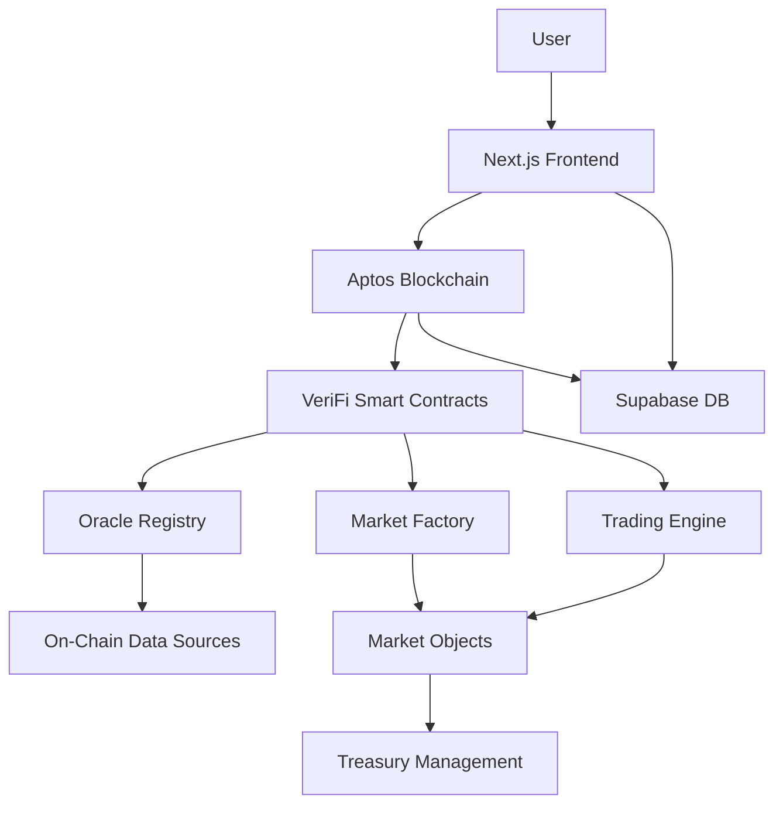

# VeriFi Protocol: The On-Chain Oracle

> **Transform on-chain data into tradable markets. No external oracles. Pure blockchain truth.**

[](https://aptoslabs.com)
[](https://verifi-protocol.vercel.app)

VeriFi is a decentralized derivatives protocol that empowers anyone to create prediction markets on verifiable, on-chain events—directly on the Aptos blockchain, without external oracles.

---

##  The Vision

Imagine a financial ecosystem where **any on-chain truth** can become a liquid, tradable market. Where creating financial instruments isn't restricted to experts, but open to the entire community. That's VeriFi Protocol.

##  The Problem

Current prediction markets face two critical barriers:

1. **Insecure Oracle Reliance**: External oracles create single points of failure
2. **Complex Market Creation**: Technical barriers exclude non-developers and silence community insights

These limitations prevent Aptos from realizing its vision of trustless, frictionless value movement.

##  Our Solution

VeriFi solves both problems with:

###  Oracle-less Architecture
Markets resolve **100% programmatically** by directly querying other Aptos contracts. Check a protocol's TVL, a DAO proposal's outcome, or any on-chain metric—without external dependencies.

###  Guided Market Creation
Our intuitive dashboard makes market creation trivial:
1. Select an Aptos protocol (e.g., "Circle")
2. Choose a metric (e.g., "Total TVL")
3. Set conditions (e.g., "exceeds 5M APT in 5 days")

Done. The template engine handles the complexity.

###  The "Market Creator" Economy
Every user can become a market creator, monetizing their ecosystem insights and knowledge.

---

##  Technical Architecture



### Smart Contracts (Move)
- **Market Factory**: Creates isolated market objects with resource accounts
- **Oracle Registry**: Whitelists and manages on-chain data sources
- **Trading Engine**: Primary issuance (1 APT = 1 YES + 1 NO)
- **Resolution Module**: Programmatic settlement via on-chain queries

### Frontend Stack
- **Next.js 15 + React 19**: Modern, performant UI
- **Aptos Wallet Adapter**: Universal wallet support
- **Supabase**: Real-time event indexing
- **shadcn/ui**: Beautiful, accessible components

### Key Innovations
1. **Resource Account Architecture**: Each market has isolated treasury
2. **Template Engine**: Maps UI selections to contract calls
3. **Hybrid Trading**: Primary issuance + AMM pools (Tapp.Exchange integration ready)
4. **Real-time Indexing**: Direct blockchain event monitoring

---

##  What We've Built

###  Core Features
- [x] Oracle-less market creation and resolution
- [x] Guided market creation dashboard
- [x] Buy/sell YES/NO outcome tokens
- [x] Portfolio tracking with P&L
- [x] Real-time notifications
- [x] Admin control panel
- [x] Comprehensive test suite (90%+ coverage)

###  Supported Oracles
- **Aptos Balance Oracle**: Track any account's APT holdings
- **USDC Total Supply**: Monitor USDC circulation
- **Extensible**: Add custom oracles via registry

###  Tapp.Exchange Integration (In Review)

**VeriFi is the first prediction market to implement a custom Tapp hook** 

We've developed `tapp_prediction_hook.move` - a complete CPMM implementation for YES/NO token trading:

-  **Full Hook Interface**: Implements create_pool, add_liquidity, remove_liquidity, swap, collect_fee
-  **Dynamic Fees**: 0.3% base fee, 0.5% during high volatility (< 1h to resolution)
-  **Auto-disable Trading**: Pools stop trading when market resolves
-  **NFT-based Positions**: Liquidity providers receive Tapp position NFTs
-  **Local Tests Passing**: Integration tested with 6/7 steps successful

**Current Status:** Submitted for review with Tapp team per their [official submission process](https://github.com/tapp-exchange/hook-documentation#submission-process). Awaiting testnet deployment approval.

**Why This Matters:**
- **Composability**: YES/NO tokens tradable on any Tapp-compatible DEX
- **Liquidity**: LPs earn fees on both outcome sides
- **Innovation**: First hook to bring prediction markets to Tapp ecosystem

See [TAPP_INTEGRATION_COMPLETE.md](./TAPP_INTEGRATION_COMPLETE.md) for technical implementation details.

---

##  Quick Start

### Prerequisites
- Node.js 18+
- pnpm
- Aptos CLI
- PostgreSQL (via Supabase)

### Installation

```bash
# Clone repository
git clone https://github.com/yourusername/verifi-protocol
cd verifi-protocol

# Install dependencies
pnpm install

# Configure environment
cp .env.example .env.local
# Add your Supabase and Aptos credentials

# Run database migrations
pnpm prisma migrate dev

# Start development server
pnpm dev
```

### Deploy Contracts

```bash
# Compile Move contracts
pnpm move:compile

# Publish to testnet
pnpm move:publish

# Generate TypeScript ABIs
pnpm move:get_abi
```

### Testing

```bash
# Run Move unit tests
pnpm move:test

# Run full E2E flow
pnpm test:full-flow
```

---

##  Documentation

- [Architecture Overview](./ARCHITECTURE.md)
- [Smart Contract Guide](./contract/README.md)
- [Testing Guide](./docs/TESTING.md)
- [Deployment Guide](./docs/TAPP_DEPLOYMENT_GUIDE.md)

---

##  Hackathon Deliverables

### Aptos Ctrl+MOVE Hackathon 2025

**Track**: DeFi & Payments

**Bounties Targeted**:
-  **Best DeFi Protocol**: Novel oracle-less architecture for trustless markets
-  **Best Use of Aptos Primitives**: Resource accounts, Object model, Fungible Assets
-  **Best UX**: Guided market creation democratizes DeFi innovation

**Key Differentiators**:
1. **First oracle-less prediction market on Aptos** - Programmatic resolution eliminates trust assumptions
2. **First prediction market Tapp hook** - Pioneering AMM integration for outcome tokens
3. **Template-driven market creation** - Non-developers can create markets in 3 clicks
4. **Production-ready architecture** - Comprehensive testing, proper error handling, event-driven indexing
5. **Composable by design** - YES/NO tokens are standard Fungible Assets, work with any DEX

---

##  Roadmap

### Phase 1: Foundation ( Complete)
- Core protocol implementation
- Primary market trading
- Basic oracle registry

### Phase 2: Enhanced Trading (In Progress)
- Full Tapp.Exchange AMM integration
- Advanced portfolio analytics
- Multi-oracle market conditions

### Phase 3: Ecosystem Growth
- AI-powered market creation (natural language)
- Cross-protocol oracle integrations
- Governance token and DAO
- Mobile app

---

##  The Team

**EdSphinx** - Full-stack Web3 Developer
-  Winner: Veritas Protocol (Infinita DeSci Hackathon)
-  Winner: SocialDrop (Base MiniApp Hackathon)
-  5+ years blockchain development
-  [GitHub](https://github.com/edsphinx) | [Twitter](https://twitter.com/edsphinx)

---

##  License

MIT License - see [LICENSE](./LICENSE) for details

---

##  Links

- **Live Demo**: [verifi-protocol.vercel.app](https://verifi-protocol.vercel.app)
- **Demo Video**: [Coming Soon]
- **Hackathon Submission**: [DoraHacks](https://dorahacks.io)
- **Documentation**: [GitHub Wiki](https://github.com/yourusername/verifi-protocol/wiki)

---

<p align="center">Built with ❤️ in Honduras and deployed on Aptos Testnet</p>
